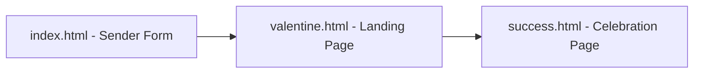

# Design Document: Valentine Email

## Overview

A simple, fun Valentine's Day prank app. Three pages: a sender form, an interactive landing page with a dodging No button, and a cute success page. Built as a static web app - no backend needed (we'll use a mailto link or the user can copy the link to send manually).

## Architecture

Super simple - just static HTML/CSS/JS files:



The sender page generates a link to share. The landing page has the dodging button magic. The success page shows hearts and a cute image.

## Components and Interfaces

### 1. Sender Page (index.html)

Simple form that generates a shareable link.

```
Page Elements:
  - Title: "Send a Valentine!"
  - Input: Recipient's name (optional, for personalization)
  - Button: "Get Link to Share"
  - Output: Copyable link to valentine.html

Function generateLink():
  Get recipient name from input
  Create URL with name as query param: valentine.html?name=TheirName
  Display link for user to copy/share
```

### 2. Landing Page (valentine.html)

The main attraction - Yes button works, No button dodges!

```
Page Elements:
  - Title: "Will you be my Valentine?" (or "Hey [Name], Will you be my Valentine?")
  - Yes Button: Big, clickable, goes to success page
  - No Button: Smaller, DODGES when you try to click it

Function dodgeButton(event):
  Get mouse position
  Calculate random new position away from mouse
  Keep button within viewport
  Animate button to new position

Events:
  - No button: onmouseover -> dodgeButton()
  - No button: onclick -> dodgeButton() (backup if they're fast)
  - Yes button: onclick -> navigate to success.html
```

### 3. Success Page (success.html)

Celebration time!

```
Page Elements:
  - Big title: "Yay! 💖" or "You said YES!"
  - Cute message: "You made my day!"
  - Cute image: Heart, couple illustration, or romantic gif
  - Optional: Confetti animation (CSS or simple JS)
```

## Data Models

Minimal - just URL query parameters:

```
URL Parameters:
  valentine.html?name=TheirName
  
  name: string (optional) - Recipient's name for personalization
```

## Dodging Button Logic

The star of the show:

```
Function calculateDodgePosition(buttonRect, mouseX, mouseY, viewport):
  // Get button center
  buttonCenterX = buttonRect.left + buttonRect.width / 2
  buttonCenterY = buttonRect.top + buttonRect.height / 2
  
  // Calculate direction away from mouse
  dx = buttonCenterX - mouseX
  dy = buttonCenterY - mouseY
  
  // Normalize and scale (move 100-200px away)
  distance = sqrt(dx*dx + dy*dy)
  moveDistance = random(100, 200)
  
  newX = buttonCenterX + (dx / distance) * moveDistance
  newY = buttonCenterY + (dy / distance) * moveDistance
  
  // Clamp to viewport
  newX = clamp(newX, 0, viewport.width - buttonRect.width)
  newY = clamp(newY, 0, viewport.height - buttonRect.height)
  
  Return { x: newX, y: newY }
```


## Styling Notes

Keep it cute and Valentine-y:

- **Colors**: Pink (#ff69b4), Red (#ff1744), White
- **Fonts**: Something playful/rounded (system fonts are fine)
- **Hearts**: Use emoji 💕💖❤️ liberally
- **Background**: Light pink or gradient
- **Buttons**: Rounded, colorful, fun hover effects

## Correctness Properties

*Since this is a scrappy fun project, we're keeping testing minimal. But here are the key behaviors that should work:*

### Property 1: Dodge Moves Button Away

*For any* mouse position near the No button, after dodging, the button should be further from the mouse than before.

**Validates: Requirements 3.1**

### Property 2: Button Stays On Screen

*For any* dodge action, the No button should remain fully visible within the viewport.

**Validates: Requirements 3.2**

## Error Handling

Keeping it simple - this is a fun project:

- If name param is missing, just show "Will you be my Valentine?" without personalization
- If something breaks, the page still looks cute (graceful degradation)

## Testing Strategy

**For this scrappy project**: Manual testing only! 

Just open the pages in a browser and:
1. Check the sender page generates a link
2. Check the landing page looks cute
3. Hover over No button - does it run away? 
4. Click Yes - does it go to success page?
5. Check success page looks celebratory

No automated tests needed - this is a fun one-off project.
